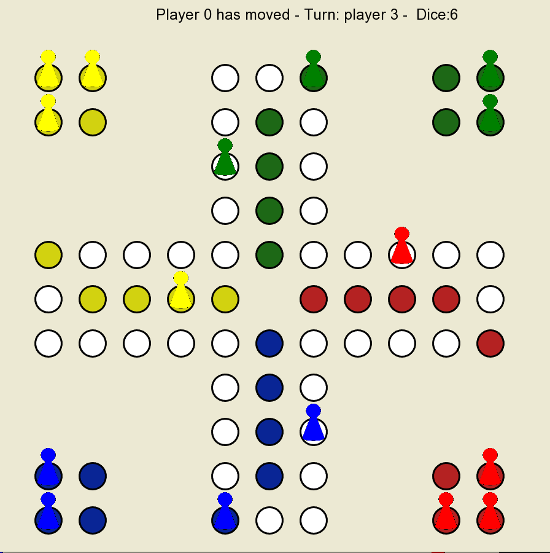

# Multiplayer-BoardGame

## Info

This project consists of two separate applications: Server and Client that communicate using POSIX Sockets.

#### The Server:
- allows Clients (maximum 4 simultaneously) to competitively play the game [Don't Get Mad Bro](https://en.wikipedia.org/wiki/Mensch_%C3%A4rgere_Dich_nicht), which is similar to [Ludo](https://en.wikipedia.org/wiki/Ludo).
- is TCP Concurrent and handles multiple Clients in parallel using POSIX Threads.
- it's PORT is `2908`

#### The Client:
- has an interactive graphic interface that registeres moves and displays the gameboard, made with `SFML 2.5.1`

If a Client wants to connect to a Server that is run on the same machine, the `IP-adress` can be set to `0`.

## Build
### Prerequisites for Linux
- `g++`
- `SFML 2.5.1 -> libsfml-dev`

To build client executable run `g++ Interface.cpp -o client-app -lsfml-graphics -lsfml-window -lsfml-system`.

To build server executable run `g++ Server.cpp -o server-app`.

## Run
The binary files are named **client-app** and **server-app**, therefore you can run them using `./client-app` and `./server-app`.

## Screenshot

